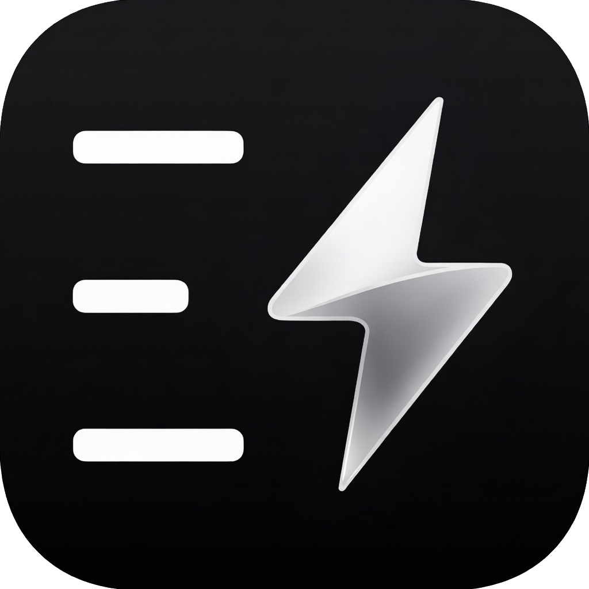
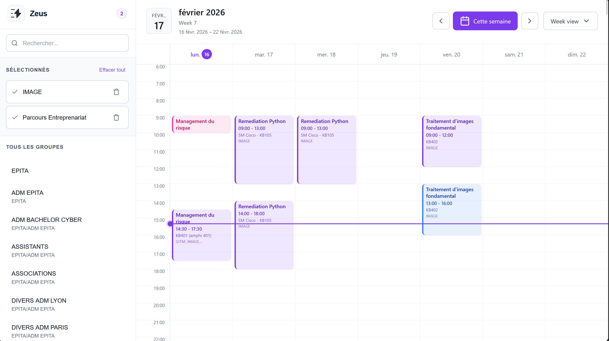
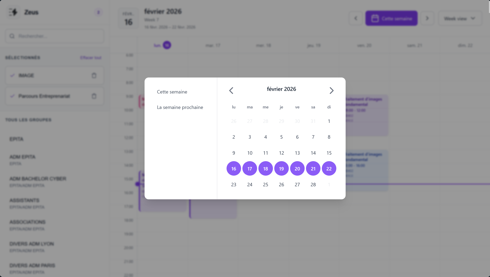
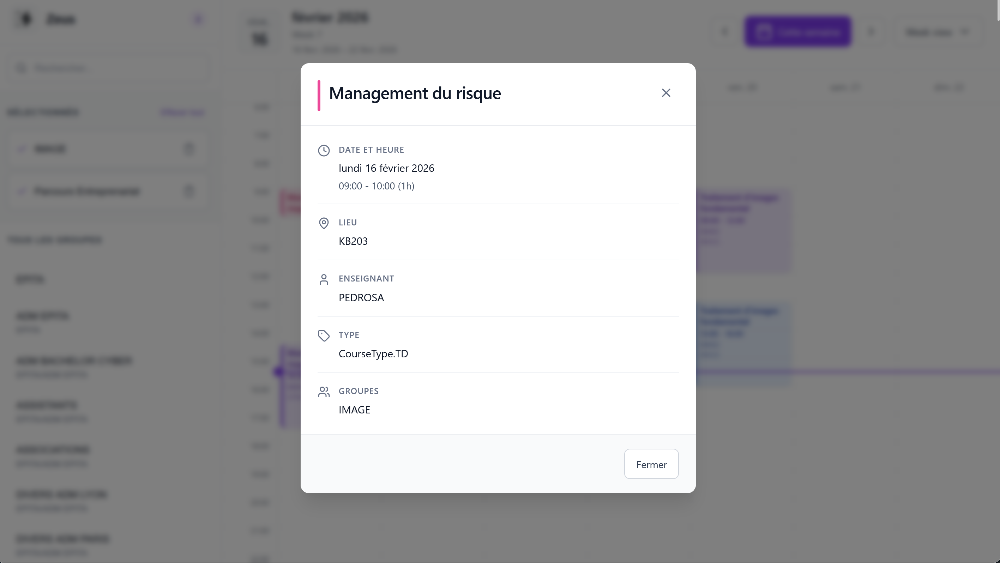

<div align="center">
  

# Better Zeus

Zeus sucks. So i made a better version, with a cool UI.

  <p>
    <a href="#installation">Installation</a> •
    <a href="#features">Features</a> •
    <a href="#screenshots--demos">Demos</a> •
    <a href="#contributing">Contribute</a>
  </p>
</div>

---



## Installation (Chrome based browsers & Firefox)

Check the release page and follow the instructions :

## [**GitHub Releases**](https://github.com/axthauvin/better-zeus/releases/)

## Features

- Daily and weekly view of the calendar, with a clear indication of the current day and week.
- Colored events based on their type (project, piscine, etc.) for easy identification.
- Responsive design that adapts to different screen sizes and devices.
- Selected courses stays even when you refresh the page, so you don't have to select them again.

---

## Screenshots & Demos





## Contributing

Pull requests and suggestions are welcome!
Feel free to open issues or submit feature ideas.

## Local Development

To use and build the extension locally:

```bash
pnpm install # please dont be a jerk and use pnpm
pnpm run build
```

This project uses [React](https://react.dev) to make it easier to develop and maintain. If you want to contribute, make sure to follow the code style and structure.

<div align="center">
<br/> <b> Enjoy Better Zeus!</b></div>
